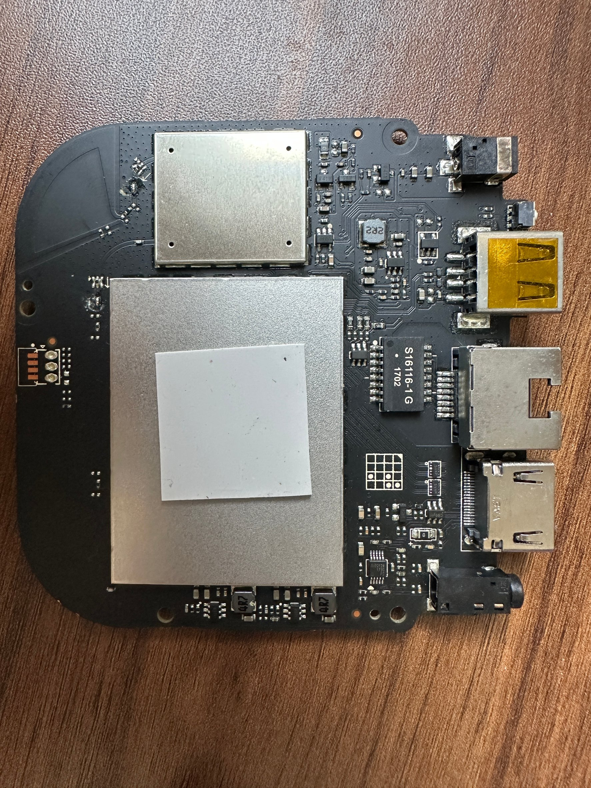
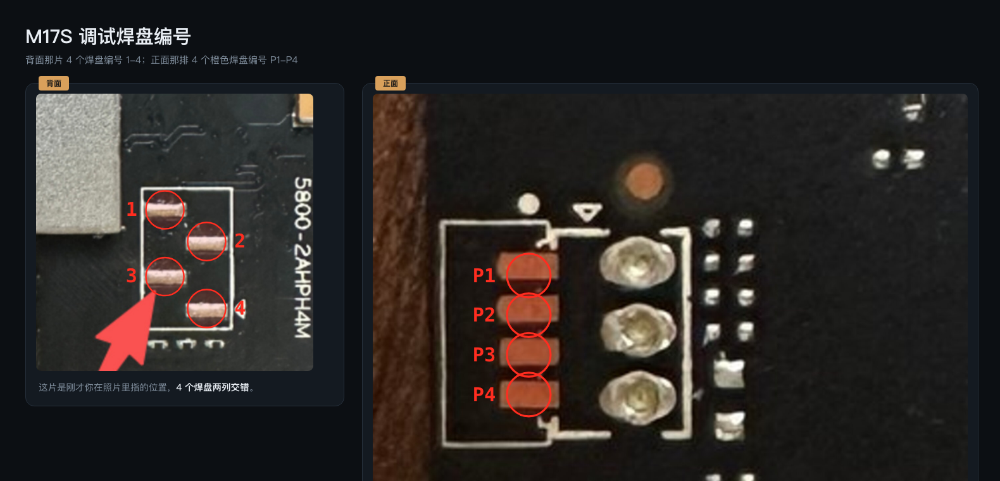

# m17s-armbian

把天猫魔盒 M17S 的主板用作运行 Armbian 的 ARM64 Linux 小主机。本项目提供 USB 启动镜像、eMMC 安装器，以及固定输入、可重跑的构建源码。本仓库原创脚本和文档采用 MIT 许可证；第三方组件保留各自许可证。

总体进度见 [项目总结](PROJECT_SUMMARY.md)，决定性启动差分见 [USB 启动与 eMMC 安装改动](docs/BOOT_CHAIN.md)，硬件调查见 [逆向材料](reverse/README.md)，HDR10→SDR 实验见 [HDR/SDR 状态](docs/HDR_SDR.md)。

当前源码为 **0.1.0rc3 候选版**；最近完成实机验证的镜像基线是 **0.1.0rc2**。边界见[当前版本状态](#当前版本状态)。

## 1. 板卡介绍与配置

这是一块电视盒子拆机主板。本项目适配的是手头这台 **M17S / S905X / 2 GiB RAM / 8 GB eMMC** 样机，PCB 可见丝印为 `5800-2AHPH4M`。原厂系统上报的型号字符串为 `MagicBox_M17`。

### 品牌与厂商

| 角色 | 说明 |
| --- | --- |
| 整机品牌 | 天猫魔盒（Tmall MagicBox） |
| 品牌 / 产品归属 | 阿里巴巴（Alibaba Group）旗下天猫魔盒产品系列 |
| SoC 供应商 | 晶晨 Amlogic，芯片型号 S905X |
| 本机 eMMC 供应商 | Samsung，设备名称 `8GME4R`，厂商 ID `0x15` |
| 板卡设计方 / 代工制造商 | **尚未核实**；Alibaba 品牌标识不足以单独确定 PCB 设计方或实际生产工厂 |

[阿里巴巴官方新闻网站 Alizila](https://www.alizila.com/alibaba-pictures-part-4-cross-media-merchandising/)将 Tmall Magic Box 列为阿里巴巴集团的家庭流媒体服务。因此，品牌与产品归属可以明确写阿里巴巴；具体板卡的设计、代工主体仍需该型号的铭牌、认证资料或原厂说明佐证。

[天猫精灵官方设备列表](https://bot.tmall.com/equipment-mobile-brand?deviceType=%E6%9C%BA%E9%A1%B6%E7%9B%92&deviceTypeId=23)将 `MagicBox_M17` 和 `MagicBox_M17s` 分别列出。因此，本项目中的 M17S 名称不能作为所有 M17/M17S 板型互相兼容的依据；使用前应核对实物、SoC、内存和 eMMC。Amlogic 是芯片供应商，不等于这块板的制造商。

### 本项目样机配置

| 项目 | 配置与验证范围 |
| --- | --- |
| SoC / CPU | Amlogic S905X（Meson GXL），4 核 ARM Cortex-A53，64 位 ARMv8-A；本机 Linux 识别 4 个在线 CPU |
| GPU | ARM Mali-450；补充安装 Mesa/Lima 后，两个 glmark2 场景及 Weston EGL 约 60 fps；完整桌面应用未验收 |
| 视频解码 | 实验配置下，真实 HEVC Main10 4K、约 63 Mb/s 电影片段经 Weston 缩放至 1080p，已确认画面流畅；HDR10→SDR shader 与 dmabuf 路径已得到可见效果和约 20–23 fps 实测，长片与内核稳定性仍待验收，见[多媒体实测](docs/MULTIMEDIA.md)与[HDR/SDR 状态](docs/HDR_SDR.md) |
| 内存 | 2 GiB DDR3；启动日志显示两个 1024 MB rank，系统可用容量会扣除固件及显示预留内存 |
| 存储 | 标称 8 GB eMMC，Samsung `8GME4R`；本机 user area 实际为 7,818,182,656 字节，约 7.28 GiB |
| 有线网络 | RJ45，内置 10/100 Mb/s PHY，硬件上限为百兆；实测 100 Mb/s 全双工，DHCP、SSH 正常；100 Mb/s 理论为 12.5 MB/s，实际有效吞吐更低 |
| USB | 1 个 USB-A 接口；已验证 U 盘启动、镜像写入和读回 |
| 显示 | HDMI；已验证 1920×1080、60 Hz 文本登录；实验配置下已验证电影缩放显示，未测试原生 4K 输出 |
| 音频 | 实验中 TrueHD、DTS-HD MA、AC-3 固定音轨可由盒子解码、下混立体声；模拟口已确认有声。常驻声卡配合 0.75 秒淡入淡出后，真实电影启停无异响；服务首次启动仍有一次硬件瞬态。实验性多音轨切换测试未通过，播放器级切轨尚未完成；HDMI 听感、Atmos 渲染未验收 |
| 无线 | Wi-Fi 未验收；蓝牙初始化出现 BCM 超时，暂不能列为可用功能 |
| 调试串口 | 3.3 V TTL UART，115200 / 8N1 / 无流控；焊盘接法见下文 |
| 供电 | 使用盒子原配或已核对铭牌的 DC 适配器；串口调试器不为主板供电 |
| 当前系统 | Armbian / Debian Bookworm，ARM64，内核 `6.12.109-ophub` |
| 设备树 | `meson-gxl-s905x-p212.dtb`；P212 是本项目采用的兼容配置，不代表此板是晶晨官方开发板 |

CPU/GPU 架构参考 [Amlogic S905X 数据手册，Features 章节](https://www.scs.stanford.edu/~zyedidia/docs/amlogic/s905x.pdf#page=11)。容量、启动、网络和显示结果来自本项目样机；芯片支持的功能不等于整板或当前 Linux 镜像已全部验证。

网口实机识别为 `Meson GXL Internal PHY`（PHY ID `0x01814400`），使用 RMII；`ethtool eth0` 的支持模式仅有 10/100 Mb/s，没有 1000 Mb/s。这与 S905X 数据手册列出的内置 10/100 Mb/s PHY 一致，因此原生 RJ45 的百兆上限来自硬件，不能通过更换驱动或解除软件限速变成千兆。本文的 `Mb/s` 是每秒兆比特，`MB/s` 是每秒兆字节，两者相差 8 倍；尚未进行网络吞吐基准测试。

多媒体结果来自安装测试软件、采用 **CMA 768 MiB 实验设备树**后的样机。原 rc2 镜像仍是 server 配置，没有包含这些改动；目前不能把它当成开箱即用的 4K 电视播放器。视频硬解使用 S905X 的 VDEC，GPU 使用 Mali-450，两者是不同的硬件与驱动。最新 HDR10→SDR 路径、吞吐和 CMA/Oops 风险见 [HDR/SDR 状态](docs/HDR_SDR.md)。

模拟音频链路首次上电仍会产生一次爆音；可选的[音频常驻服务](extras/audio-keeper/README.md)可让声卡在开机后保持打开，避免每次播放都反复上下电。该服务属于实验附件，未写入 rc2 镜像。



*样机主板正面。接口集中在右侧；实际串口接线使用下文的背面焊盘，不使用照片左侧正面的那排橙色焊盘。*

## 2. 刷机接线方案

本方案的路径是 **先从 U 盘启动 Armbian，再由 Linux 安装器写入 eMMC**。串口负责读取启动日志和输入命令，镜像数据通过 U 盘或网络传输。这不是 USB Burning Tool 双公头烧录方案，也不需要短接 eMMC。

### 所需器材与整体连接

| 器材 | 用途 |
| --- | --- |
| 电脑 | 写入 U 盘镜像、运行串口终端、通过 SSH 操作系统 |
| 至少 8 GB、可清空的 U 盘 | USB 启动盘；本次使用约 15.4 GB 的 SanDisk U 盘 |
| 支持 **3.3 V TTL 信号**的 USB 转串口调试器 | 本次使用 CH340；需要 GND、RXD、TXD 三根线及稳定探针或焊接线 |
| 原配 DC 电源、HDMI 线、显示器 | 主板供电和观察启动画面 |
| 网线、带 DHCP 的路由器或交换网络 | SSH 登录，以及传输安装文件和备份 |
| 足够大的外部磁盘或网络存储 | 保存完整 eMMC 备份及解压工作区；空间要求见下文 |
| USB 键盘（可选） | 未预置公钥时用于本地首启设置；与启动 U 盘同时连接需要 USB Hub，此路径和 Hub 兼容性尚未在样机上验收 |

```text
电脑 USB ── USB–TTL 调试器 ── GND / RXD / TXD ── M17S
                                                   │
写好的 U 盘 ──────────────────────────────── USB-A │
路由器 / 局域网 ────────────────────────────── RJ45 │
显示器 ────────────────────────────────────── HDMI │
盒子原配电源 ────────────────────────────────── DC │
```

盒子已激活多启动、USB 和 eMMC 启动均正常后，日常使用可通过 HDMI 或 SSH，串口不是常驻必需品。本版安装流程要求已完成并验证原厂多启动（vendor multiboot）激活；原厂 Android 的首次激活不由安装器自动完成。

### 串口焊盘：以背面实拍方向为准

下图**只采用左侧“背面”的 ①–④ 编号**。右侧“正面”的 P1–P4 是另一组候选焊盘的编号，未用于本项目最终接线，不能套用同一脚序。



保持左图方向：`5800-2AHPH4M` 丝印位于焊盘右侧。背面四个焊盘分两列交错排列：

```text
①    ②  ← 上侧
③    ④  ← 下侧
```

| USB–TTL 调试器端 | 连接到 M17S | 信号方向 |
| --- | --- | --- |
| **GND** | **HDMI 接口的金属外壳**，固定夹牢 | 两端共地 |
| **RXD** | **背面③，左下焊盘** | 接收主板 TX 的启动日志 |
| **TXD** | **背面②，右上焊盘** | 向主板 RX 发送输入 |
| **VCC / 5V / 3V3 供电脚** | **悬空不接** | 主板由独立 DC 电源供电 |

**RXD/TXD 都按调试器端命名：RX 接板端 TX，TX 接板端 RX。** ①和④的电气功能没有在本方案中确认，保持不接。焊盘位置只对照片中的这块板负责；板型或布局不同，应先测量确认。

调试器必须输出 3.3 V TTL 信号。部分模块的“3.3V/5V”跳线只切换 VCC 供电引脚，不能据此认定 TXD 已降为 3.3 V，应核对模块说明或实测。不要接 RS-232 电平串口。

### 接线与上电顺序

1. **先拔盒子 DC 电源**，将主板放在绝缘、稳固的表面，核对背面焊盘方向。
2. 调试器 GND 夹到 HDMI 金属外壳，RXD 接③，TXD 接②；VCC 不接。固定探针，避免滑到相邻焊盘。
3. 调试器接电脑，打开串口终端；选择 **115200、8 数据位、无校验、1 停止位、无软/硬件流控**。同一个串口只由一个终端程序占用。
4. 插好已写入并校验的 U 盘，接 HDMI 和网线。**最后接 DC 电源**，从上电瞬间开始记录日志。
5. 看到 Linux 登录提示后，用 SSH 或本地首启流程进入系统，再按下文执行备份和 eMMC 安装。串口启动日志不等同于已取得登录权限；本项目镜像不提供默认 root 密码或自动 root shell。
6. 安装成功后执行 `sudo systemctl halt`；确认串口出现 `System halted`，再拔 DC 电源和 U 盘。等待约 5 秒后只接回 DC 电源，验证 eMMC 独立启动。

本机曾在 `poweroff` 后进入固件挂起并再次唤醒，因此冷启动测试以**实际断开 DC 电源**为准。`System halted` 表示系统停机，不表示主板已断电。

macOS 可先找到调试器设备名，再用终端查看日志：

```sh
ls /dev/cu.usbserial*
# 将设备名替换为上一条实际列出的串口
screen /dev/cu.usbserial-XXXX 115200
```

`screen` 退出：按 `Ctrl+A`，再按 `K`，确认退出。Linux 常见设备名为 `/dev/ttyUSB0`，也应先核对实际设备。

### 接线排错

| 现象 | 先检查什么 |
| --- | --- |
| 上电后没有任何字节 | 盒子是否真的重新上电；串口设备和波特率；GND、③的探针接触；是否有其他程序占用串口 |
| 只收到半行或时有时无 | 固定探针并检查地线；不能只凭静默就判定系统或焊盘损坏 |
| 持续乱码 | 115200 / 8N1、共地、接触和信号电平 |
| 能看日志但命令无响应 | ②的接触、流控及当前是否处于可交互的控制台；本机 U-Boot 输入曾不稳定，不能保证按键一定截停 |
| HDMI 黑屏但串口或 SSH 正常 | 继续检查显示输出与系统状态；黑屏本身不能证明系统死机 |

## 当前版本状态

**0.1.0rc3 是源码候选版，尚未重建发行镜像或重新执行实机安装。** 相比已验证的 rc2，它新增末扇区备份 GPT 检查，并将完整 `uEnv.txt`、`manifest.json` 和可选 `firstboot.json` 纳入激活前后的逐字节读回；63 项单元测试已通过。这些源码改动必须重新构建并走完整 USB/eMMC 验收后，才能取得新的硬件验证状态。

**0.1.0rc2 是存在已知问题的本地镜像基线。** 它已完成完整备份、真实 eMMC 安装和最终拔除 U 盘后的 eMMC 冷启动；原版 USB 参数连续两次冷启动复测通过，HDMI 登录提示、公钥 SSH、sudo 与控制台服务顺序均正常。但 USB 曾发生一次内核早期卡住，原因尚未确定，复测成功不代表问题已修复。Bluetooth 初始化仍有超时；Wi-Fi 未验收。安装额外软件后的真实电影与模拟音频实验见[多媒体实测](docs/MULTIMEDIA.md)，这些改动没有打入 rc2 镜像。硬件范围见 [兼容性说明](docs/COMPATIBILITY.md)。

本地验证项目、结果与未覆盖范围见 [验证说明](docs/VALIDATION.md)。

## USB 启动改动

原厂 U-Boot 仍然保留。项目通过串口 root console 一次性设置 `start_usb_autoscript`、`start_emmc_autoscript`、`start_autoscript`，并把 `bootcmd` 改成：

```text
run start_autoscript; run storeboot
```

这样先尝试 USB/eMMC 外部脚本，失败时仍可落回原厂 `storeboot`。USB FAT 分区还做了三个关键修改：

1. 保留上游 `s905_autoscript`，让原厂 U-Boot 能发现项目 U 盘。
2. 将 `u-boot-p212.bin` 复制为 `u-boot.ext`，先切换到主线 P212 U-Boot，绕过原厂 `booti` 修改标准 DTB 时的 `FDT_ERR_NOTFOUND` 和 `Synchronous Abort`。
3. 在 `uEnv.txt` 固定 P212 DTB、USB 根 UUID、串口和 1080p HDMI 参数。

```text
原厂 U-Boot -> USB:s905_autoscript -> USB:u-boot.ext
             -> uEnv.txt -> zImage/uInitrd/P212 DTB -> USB rootfs
```

构建器同时把 `m17s-emmc`、`m17s-boot`、`m17s-firstboot` 和板卡 profile 装进 USB rootfs，清除机器身份与 SSH 密钥，锁定 root，并禁用会绕过保护逻辑的通用 `armbian-install`/内核更新入口。完整文件级差分见 [USB 启动与 eMMC 安装改动](docs/BOOT_CHAIN.md)。

## 从 USB 安装 eMMC 的改动

构建器单独生成 511 MiB bootfs 和 4 GiB rootfs 分区载荷；它们不是整盘镜像。`m17s-emmc` 从已启动的 USB 系统执行，保留厂商签名引导区，只写：

```text
前 700 MiB：保留
p1：从 700 MiB 开始，511 MiB FAT bootfs
间隙：保留
p2：从 1212 MiB 开始，ext4 rootfs 扩展到盘尾
boot0/boot1：保留
```

安装器先绑定设备型号、容量、CID、P212/2 GiB profile 和分区几何，再完整备份 user area、boot0、boot1。rootfs 和 bootfs 均写后读回；根 UUID 在目标盘上重新生成。bootfs 初始不含激活脚本，本次生成的全部被动启动文件与受保护区域校验通过后，最后才写 `emmc_autoscript`。

eMMC 使用两阶段 RAM 引导：原厂 U-Boot 从 p1 预载内核、initrd、DTB、第二阶段脚本和 `u-boot-m17s-ram.bin`；后者只是 `u-boot-p212.bin` 的 RAM 副本，并仅把内置 `bootcmd=run distro_bootcmd` 等长改为 `bootcmd=source 0x021000000`（即 `0x21000000`）。项目没有覆盖前 700 MiB 中的厂商 U-Boot。

```text
原厂 U-Boot -> eMMC:emmc_autoscript -> 载荷全部进入 RAM
             -> u-boot-m17s-ram.bin -> m17s-ramboot.scr
             -> booti -> eMMC p2 rootfs
```

## 交付物

| 文件 | 用途 |
| --- | --- |
| `m17s-usb-<version>.img.gz` | 完整 USB 磁盘镜像，使用容量至少 8 GB 的 U 盘 |
| `m17s-emmc-bootfs-<version>.vfat.img.gz` | 511 MiB eMMC FAT 分区载荷，未激活 |
| `m17s-emmc-rootfs-<version>.ext4.img.gz` | 4 GiB eMMC 根分区载荷，安装时扩容并生成新 UUID |
| `release.json` / `SHA256SUMS` | 输入来源、镜像大小、压缩及解压 SHA-256、候选状态 |
| `boot-validation.json` | eMMC 两阶段启动载荷、地址边界、原始 U-Boot 身份及补丁校验结果 |

`<version>` 由源码包版本决定；当前源码会生成 `0.1.0rc3` 文件名。已有 rc2 实机结果只约束历史 rc2 镜像，不自动覆盖重新构建的 rc3。

eMMC 两个文件必须交给 `m17s-emmc`，**不能当作整盘镜像直接写到 eMMC**。设备原有的签名引导器和环境区不在发行包中。没有默认登录密码，也不携带设备私钥、SSH 主机密钥或已创建账户。

发行目录的 `validation/hardware.json` 和 `validation/HARDWARE.md` 记录后续实机验收，并绑定不可变 `release.json` 的哈希；清单内保留构建时的 `candidate-not-hardware-tested` 状态。

发行镜像尚未上传公开下载站；现有 rc2 本地构建结果位于指定输出目录，尚无发布者签名。rc3 目前只有源码和测试结果。

## USB 启动与首启

1. 在可信来源核对 `SHA256SUMS`。Linux 使用 `sha256sum -c SHA256SUMS`，macOS 使用 `shasum -a 256 -c SHA256SUMS`。
2. 将 **USB 镜像** 写入可清空的 U 盘；图形写盘工具中确认目标是 U 盘。写盘会清空选中的介质。
3. 本版要求盒子已完成并验证 vendor multiboot 激活。首次从原厂 Android 启动 USB 的激活步骤不在自动安装流程中。原上游激活脚本保存在 FAT 分区的 `multiboot-activation/`，不会自动执行；它会修改原厂环境，应在核对适用流程后单独处理。
4. 接 HDMI、USB 键盘和网线启动，按 tty1 提示创建普通 sudo 用户。也可先在 USB 的 FAT 分区放入 `firstboot.json`：

```json
{
  "hostname": "m17s",
  "username": "m17s",
  "ssh_authorized_keys": ["替换为你自己的完整 OpenSSH 公钥"]
}
```

示例公钥占位符不可直接使用。仅公钥模式为该账户配置免密码 sudo；不接受私钥或 JSON 明文密码。完成首启后才开放 SSH，root 登录禁用。详细说明见 [首启配置](docs/FIRST_BOOT.md)。USB 启动不会自动安装 eMMC。

USB 根分区首版固定为 4 GiB，未自动扩容。完整备份与解压工作区应放在另一块足够大的磁盘或已挂载的网络存储上；不要放在 `/tmp`（它是内存文件系统）。备份建议至少预留 9 GiB，解压工作区另留 5 GiB。

## eMMC 安装

在本项目 USB 系统上运行。先确认目标设备，**不能照抄设备名**：

```sh
lsblk -o NAME,SIZE,TYPE,MOUNTPOINTS,MODEL
sudo m17s-emmc probe --target /dev/mmcblkX
sudo m17s-emmc plan --target /dev/mmcblkX --release-dir /path/to/release --output /path/to/plan.json
sudo m17s-emmc backup --plan /path/to/plan.json --output /external/backup-new
sudo m17s-emmc apply --plan /path/to/plan.json --release-dir /path/to/release \
  --backup-manifest /external/backup-new/backup.json --work-dir /external/work \
  --firstboot-config /boot/firstboot.json --apply
```

默认只接受已经验证的 700 MiB / 1212 MiB 双分区布局。原厂设备仅在内核看不到分区、MBR 表与签名字节全零，且 LBA1 主 GPT 头与末扇区备份 GPT 头均不存在时，可显式在 `plan` 增加 `--initialize-layout`；其他布局拒绝执行。初始化仅改变 MBR 的 446–511 字节，其余前 700 MiB 及 boot0/boot1 受校验保护。

先建立 `/external/work`，并把示例路径替换为实际挂载位置。`--firstboot-config` 必须含有效公钥；省略它则 eMMC 首启需要 HDMI 和键盘创建账户。安装前阅读 [安装器范围](docs/INSTALLER.md)。`apply` 需要完整且可读回校验的备份、与设备绑定的计划和明确的 `ERASE` 确认；没有自动确认选项。安装完成不会自动重启。

## 启动维护

```sh
sudo m17s-boot verify
m17s-boot stage --help
```

`verify` 校验已安装 eMMC 的活动脚本、内核、initrd、DTB、U-Boot 补丁与 manifest。`stage` 默认只检查，明确 `--apply` 才写入新槽位，全部落盘后最后切换入口，并保存上一入口。**0.1 只允许内核字节和根 UUID 均保持不变的 initrd/DTB 刷新，不支持内核升级**，同版本号的另一份内核也会被拒绝。通用 `armbian-update`、`armbian-install`、`armbian-sync` 等入口已禁用，内核 APT 包也被限制；用户空间软件可正常维护。

## 从源码构建

需要 Python 3.11+、Docker，以及约 20 GiB 空余空间。已锁定 ARM64 构建容器 digest；在 ARM64 Mac 的 Docker Desktop 中可构建，Linux ARM64 也可使用。构建容器使用 loop mount 所需特权，但代码只接受普通镜像文件，没有物理写盘参数。

```sh
PYTHONPATH=src python3 -m unittest discover -s tests -v
PYTHONPATH=src python3 -m m17s_armbian.build --cache ./cache --output ./dist
```

输出目录必须为空。构建器验证基础镜像的大小和 SHA-256，从只读基础系统重建文件系统，安装工具，执行隐私检查、启动载荷校验与文件系统检查，最后生成 gzip 镜像和清单。来源与容器在 [sources.lock.json](sources.lock.json) 中固定。

构建中断后，先确认本次容器已退出、没有残留 loop 挂载，再清理缓存中的 `build-work/` 和未完成的输出目录重试；不要把中断的文件作为发行物。大容量中间镜像保存在 `--cache` 所在磁盘，Docker 内部盘只承担少量运行时文件。

本项目提供固定输入、可重跑的构建流程；启动脚本生成是确定性的，**尚未证明整个 ext4/FAT 镜像逐字节一致**。基础 Debian/内核来自上游二进制；P212 U-Boot 的精确 dirty 构建源码仍需补齐。不能称为整套固件完全从源码重建，详情见 [第三方组件](THIRD_PARTY.md)。

## 贡献与发布

变更需通过单元测试；涉及磁盘写入还需隔离 loop 设备集成验证。真实 M17S 的新镜像首启、USB 恢复、eMMC 安装、连续冷启动和 HDMI 检查是稳定版发布门槛。备份、日志里的密钥、设备 CID、MAC、私人网络配置不得提交到源码仓库或发行包。

本仓库原创脚本和文档见 [MIT LICENSE](LICENSE)，上游内容保留各自许可证。公开二进制发布前仍需补齐第三方来源与发布签名；已覆盖的实机范围见验证说明。
